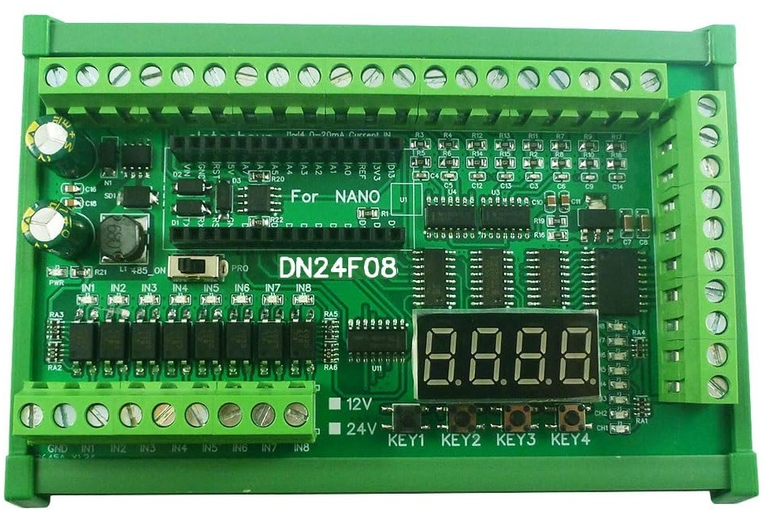

## Intro
This is a library to control the DN24F08, a PLC type expansion board for the Arduino Nano form factor. However, this library was written specifically for the ATmega328p version.  

I came across the board on AliExpress and was curious enough to buy one as it was was only ~€20 at the time.  

The board typically comes in a number of different forms, with or without DIN rail mount, relay or darlington array (DN23E08 or DN24F08 respectively) and 12V or 24V. The model I got was the 24V, DIN rail mount, darlington array version.  

I have optimized this library to reduce RAM usage, so along with the control logic I have included an additional library for bare metal UART communication.  

  
*The DN24F08 board.*

## Library Features

## Connectivity
### 1. Analog Inputs
The board has 8 analog inputs, 4 are used to measure voltage and 4 are for reading current.

* **Current Reading:**
    * Inputs: 4.
    * Converter type: Shut Resistor.
    * Board Names: I1-I4.
    * Operating range: 0-20mA.
    * Signal acquisition: Onboard ADC (A0-A3).

The current inputs are passed through high precision shunt resistors and into an LM324DR quad Op-Amp, set up in a buffer configuration.

* **Voltage Reading:**
    * Inputs: 4.
    * Converter type: Voltage divider.
    * Board Names: V1-V4.
    * Operating range: 0-10V.
    * Signal acquisition: Onboard ADC (A4-A7).  

The voltage inputs are passed through voltage dividers and into an LM324DR quad Op-Amp, set up in a buffer configuration.

### 2. Digital Inputs
* Inputs: 8.
* Type: NPN.
* Board Names: IN1-IN8.
* Operating range: 0-12V or 0-24V depending on the model.
* Signal acquisition: 8-bit parallel-load shift register.

The board has 8 NPN opto-coupled digital inputs. NPN (sinking) meaning that the input has to be pulled low (to ground) to register a signal.  
These 8 inputs are read using a 74HC165, this is an 8-bit parallel-load shift register.

### 3. Buttons
* Inputs: 4.
* Type: NPN.
* Board Names: KEY1-KEY4.
* Operating range: 0-5V.
* Signal acquisition: Digital input with internal pull-up resistor.  

There are 4 SMD buttons on the board labeled KEY1-KEY4. These are coupled to pins D5-D8 respectively.

### 4. Digital Outputs
* Outputs: 8.
* Type: NPN.
* Board Names: OUT1-OUT8.
* Operating range: 0-12V or 0-24V depending on the model.
* Signal generation: 8-bit parallel-out shift register.

The 8 digital outputs are controlled using a 74HC595D, which is an 8-bit parallel-out shift register. There are three 74HC595D's on the board and are connected in series, with the first two controlling the seven segment display and the final one in the chain controls the digital outputs. The outputs from the last 74HC595D are connected to the inputs of a ULN2803, an 8-channel darlington transistor array. This chip is designed for controlling high voltage, high current inductive loads with an NPN output and features a built in flyback diode.

### 5. Four Character, Seven Segment Display
* Outputs: 12
* Type: LED (4 character, 7 segment display)
* Operating range: 0-5V.
* Signal generation: Two 8-bit parallel-out shift registers.

The seven segment display is controlled using 2 74HC595D in series.

### 6. RS485
* Type: Serial communication.
* Board Names: A+ and B-.

This board has a DIP switch located beside the RX and TX pins on the Nano. To use the RS485 chip (SP485), this must be in the "485_ON" position. If you need to program the Nano via USB, the DIP switch must be in the "PRO" position. When using the SP485, there is also receive/transmit pin that must be toggled which is connected to D13 on the Nano (This is taken care of in the library).

## Conclusion