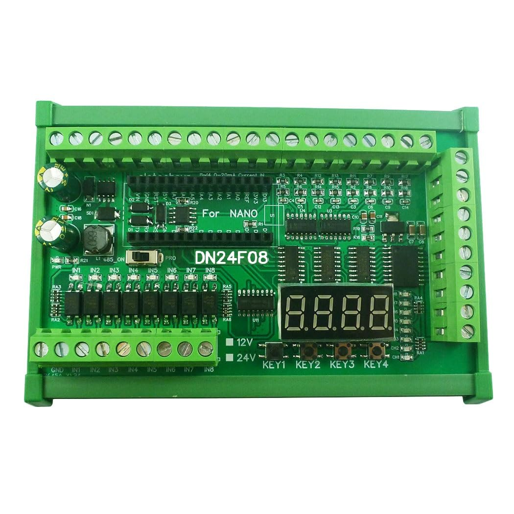

## Intro
This is a library to control the DN24F08, a PLC type expansion board for the Arduino Nano form factor. However, this library was written specifically for the ATmega328p version.  

I came across the board on AliExpress and was curious enough to buy one as it was was only ~€20 at the time.  

The board typically comes in a number of different forms, with or without DIN rail mount, relay or darlington array (DN23E08 or DN24F08 respectively) and 12V or 24V. The model I got was the 24V, DIN rail mount, darlington array version.  

I have optimized this library to reduce RAM usage, so along with the control logic I have included an additional library for bare metal UART communication.  

  
*The DN24F08 board.*

## Connectivity
### 1. Analog Inputs
The board has 8 analog inputs, 4 are used to measure voltage and 4 are for reading current.

#### 1.1 Current Reading:
* Channels: I1-I4.
* Allowable range: 0-20mA.
* The current inputs are passed through high precision shunt resistors and into an LM324DR quad Op-Amp, set up in a buffer configuration.

#### 1.2 Voltage Reading:
* Channels: V1-V4.
* Allowable range: 0-10V.
* The voltage inputs are passed through voltage dividers and into an LM324DR quad Op-Amp, set up in a buffer configuration.

### 2. Digital Inputs
* The board has 8 NPN digital inputs. NPN (sinking) meaning that the input has to be pulled low (to ground) to register a signal.  
* 

### 3. Buttons

### 4. Digital Outputs

### 5. Four Character, Seven Segment Display

### 6. RS485

## Library Features

## Conclusion